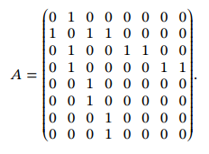
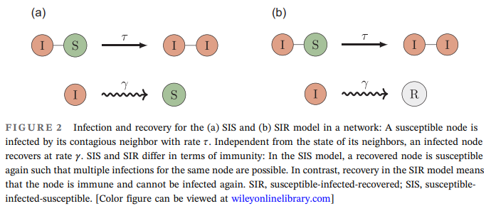
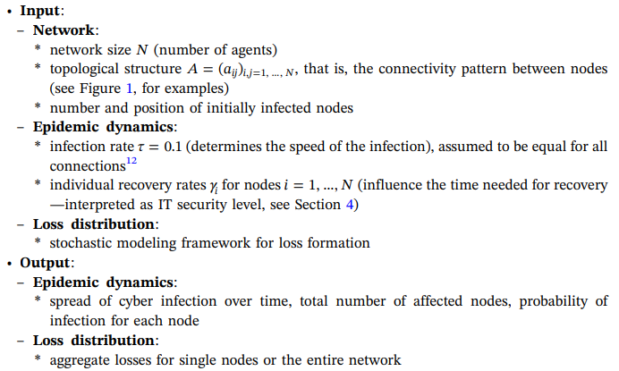
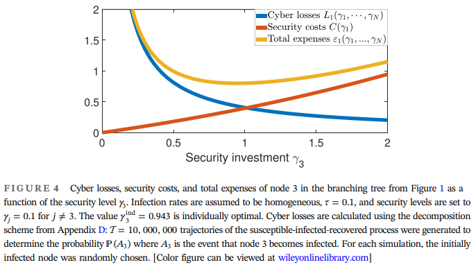

# Building resilience in cybersecurity: An artificial lab approach

> Title : Building resilience in cybersecurity : An artificial lab approach
>
> Authors : Kerstin Awiszus, Yannick Bell, Jan Lüttringhaus, Gregor Svindland, Alexander Voß, Stefan Weber
>
> Journal : Journal of Risk and Insurance 2023

#### 용어 정리

- Digital Twin : 객체가 있고, 그 객체에 대한 가상의 객체를 만들어서 두 객체를 데이터로 연결하는 것.
- Lab : 

### 1. Introduction

사이버 리스크의 영향력은 현재 증가하는 중이며, potentially **catastrophic consequences of cyber risk**는 주목할만한 이슈임.

- systemic relevance of certain types of cyber threats is highlighted.

- Systemic cyber risk에는 대표적인 두 사례가 있음:
  - WannaCry: 이 회사가 150개국의 230,000개의 컴퓨터 랜섬웨어로 감염시킴. 이때 데이터 암호화했는데, 이로 인해 data loss, IT 시스템을 사용할 수 없게 되면서 damage발생. 
  - NotPetya: 우크라이나에 NotPetya malware가 발생함. 이로 인해 데이터 암호화되고 IT서비스가 교란됨. 이로 인해 은행과 주식시장에 손해가 영향이 가서 영구적인 손실이 발생하게 됨. 

본 논문에서는 연결되어 있는 시스템 내에서 발생하여 전염이 되는 systemic cyber risk에 대해 연구하였음.

- 하지만 사이버 위협은 빠르게 성장하고 있기 때문에 모든 attack을 막는 것은 사실상 불가능함.
  - 따라서, **사이버 위협에 대한 회복력이 중요함.** 
  - 사이버 회복력이란? : ability to anticipate, withstand, recover from, and adapt to adverse conditions, stresses, attacks, or compromises on systems that use or are enabled by cyber resources.
- 다양한 법적인 제도도 마련이 되었지만, 이러한 노력은 사이버 위협에 대한 적절한 수준의 보호나 사이버 회복력에 대한 적절한 측정을 할 수는 없음. 

본 논문에서는 아래 4가지 contributions을 가지고 있음.

- 첫 번째 contribution : 사이버 시스템 내 디지털 트윈방식인 artificial cyber lab을 디자인하였음.
  - 디지털 트윈이란?: physical entity, a virtual counterpart, and **the data links** between them.
    - physical entity : interconnected cyber-physical systems
    - virtual counterpart : based on network contagion models
- 두 번째 contribution : 사이버 회복력 분석을 위한 실제 세계의 virtual counterpart로부터 인공적인 데이터 생성하는 lab 활용
  - Security-related interventions : 사이버 네트워크 내 상호연결된 요소들은 안전을 위한 투자를 한다.
  - Topology-based interventions : 네트워크의 위상의 중요성... 이와 관련된 연구 진행
- 세 번째 contribution : 사례들에 대한 연구를 바탕으로, 실제 사이버 시스템 네트워크 내에서 사용되거나, 사용 논의되고 있는 선별된 규제 측정모형들을 논의하였음.
- 네 번째 contribution : 현재 유럽과 미국내 사이버 안전 분야에서 사용 중인 규제모형을 다루었으며, 사이버 보험 기업과 같은 private actor들의 역할에 대해 다루었음.

#### 1.2 Outline

본 논문의 구조

- Section 2: 유럽과 미국에서 사용되고 있는 현재 사이버안전과 관련된 법적 규제에 대한 설명 및 보험회사들의 법적 역할 언급.
  - 추가로, 사이버 안전을 강화할 수 있는 접근법 또한 설명
- Section 3: 인공 사이버 랩에 대한 소개
- Section 4~5 : 안전/구조 측면에서 사이버 회복력 측정 분석에 대한 사례 연구 수행
  - 이러한 수행들을 바탕으로, Section 2에서 설명한 접근법 다시 설명
- Section 6 : 결론

### 2. The Real Word : The Current state of Cybersecurity Regulation

이 챕터에서는 아래 두 가지를 다룰 것임.

- 현재 통용되고 있는 사이버안전 관련 법률의 주요 특징
- 사이버안전을 다루는 보험회사(private actors)들의 역할

#### 2.1 Current government regulations for cybersecurity

정책 입인자들은 중립적인 법률 용어를 사용함.

- 왜냐하면 정적이지 않다는 사이버 영역의 본질 때문임.
  - 대표적인 중립적인 법률 용어는 "adequate security measures", "adequate technical and organizational measures"

- 이로 인해 올바른 사이버안전 측정에 대한 불확실성을 가져오게 됨.
- 최근들어 기관에서 제정하는 기술 관련 기준 및 가이드라인이 점점 늘고 있는데, 이러한 기준들은 아래의 문제점이 있으며, 이러한 문제들로 인해 위 기준들을 실행하는 것이 어려움.
  - 먼저, 민간 기업들은 법적 구속력이 없음. 즉 이런 가이드라인을 내놓는다 하더라도 민간기업들에게 강요하지 못함. (binding nature)
  - 민간기업들은 상당히 복잡하다는 특징이 있음. (complexity)

다음은 유럽과 미국에서 사용되고 있는 사이버안전 법률이다.

- 먼저 중요한 인프라에 대한 보호 관련 법령
  - 유럽에서는 사이버 안전을 위한 최소한의 기준을 설정해놓음.
    - 하지만 구체적이지는 않음.
  - 미국에서는 

#### 2.2 Regulations by private actors and the role of insurance companies

사이버 보험은 기업들이 사이버리스크를 잘 관리하고 적절한 사이버 측정방식을 찾을 수 있게 하는 효율적인 방법이다.

- 사이버 안전 분야에는 중립적 용어 사용으로 인한 취약점이 존재하며, 이러한 법률들이 기업들을 통제하기에 충분치 못함.
- 보험회사와 금융기관에게 사이버 안전은 매우 중요함.
  - 그들이 지는 사회 내 중요도와 그들이 지니고 있는 민감한 데이터 때문
  - 또한 미국 은행 및 보험 산업 내에서 점점 더 관련성이 높아지고 있음.
- 따라서 본 논문에서는 사이버보험 회사들이 보험계약자들에게 사이버안전 표준을 촉진시킬 수 있는 특정 역할에 중점을 둠.
  - 사이버 보험은 기업들에게 매우 도움이 되는 방법이기 때문에, 보험회사들은 특정 기준을 설정함으로써 사이버 안전과 사이버 회복을 촉진시킬 수 있음.

#### 2.3 Selected measures of cyber resilience

### 3. The Artificial Cyber Lab - The Digital Twin of a Complex Cyber System

사이버리스크와 관련된 데이터는 상당히 희소하며, 비정적 (non-stationary)하다는 특징이 있음.

- 이는 전통적인 통계 및 계리모형에는 적합하지 않음.
  - 이는 빈도 심도 접근이며 충분한 데이터가 필요하기 때문
- 따라서 전통적인 방식으로는 cyber resilience intervention 관찰이 적합하지 않음.

**따라서 본 논문에서는 artificial cyber lab을 도입함**. 이는 3가지의 구성요소가 필요함.

- 상호작용을 표현하는 **네트워크**
- 상호작용 채널을 통해 진화하는 특정 cyber threat의 확산을 설명하는 **모델**
- cyber threat 확산으로 인해 여러 에이전트에서 발생하는 손실을 설명하는 **손실 모델**

#### 3.1 Network

내부연결된 agent들의 시스템은 네트워크로 표현이 가능하다.

- agent는 노드로, interaction channel은 엣지로 표현함.
- 
- 

#### 3.1.1 Random network models

방향성 없는 무작위 네트워크는 2 종류의 네트워크가 존재한다.

- **Erdős–Rényi networks**
  - 네트워크 내 모든 엣지가 다 같은 확률 p로 나타남.
- **Barabási–Albert networks**
  - perferential attachment principal을 따름.
  - 새로 생성되는 노드는 엣지가 많이 연결된 인기많은 노드에 연결될 가능성이 높음.
  - few nodes of high degree

#### 3.1.2 Measuring centrality

Centrality measure C는 네트워크 내 단일 노드/엣지의 구조적 중요도(기여도)를 표현하는 지표다.

- 엣지 e에 대한 중요도
  - $\mathcal{C}^{\textbf{edge}}(e) = \Sigma_{i,j} \frac{\sigma_{ij}(e)}{\sigma_{ij}}$
  - $\sigma_{ij}$ : 노드 i와 노드 j 간의 가장 짧은 edge
  - $\sigma_{ij}(e)$ : e를 통해 지나가는 길들의 전체 개수
- 노드 i에 대한 중요도
  - Degree Centrality : $\mathcal{C}^{\textbf{deg}}(i) = \Sigma_{j=1}^{N} a_{ij}$
  - Betweenness Centrality : $\mathcal{C}^{\textbf{bet}}(i) = \Sigma_{j,h}\frac{\sigma_{jh}(i)}{\sigma_{jh}}$
    - 연결 측면에서의 노드의 역할을 중요시 여김

#### 3.2 Modeling contagious cyber risks

네트워크 내 여러 채널들을 통해서 contagious cyber risk가 확산된다.

- agent 집합을 시간에 따른 카테고리로 구별하였으며, 다음과 같이 구분지음.
  - infection, infected, recovered
- SIS, SIR 총 2개의 마코브 모델을 사용하였음.
  - SIS Framework : 재감염된 객체가 등장할 수 있음.
  - SIR Framework : 재감염된 객체는 없고, 한번 회복되면 영원히 recovered individual로 인식함.
- 2개의 파라미터 사용 : infection rate ($\tau$), recovery rate ($\gamma$)
- 

#### 3.3 Cyber loss models

모델링의 목적에 따라 네트워크의 역할이 달라짐.

- 감염된 구성 성분의 전체 개수에 주목할 수 있음.
- 네트워크 전체 총 손실 집계에 주목할 수 있으며, 혹은 단일 노드에서 발생한 금전적 손실만 관찰할 수 있음.

적절한 모델은 아래의 조건을 만족해야 함.

- 위험 시나리오에 대한 확률적 특성 반영할 수 있어야 함.
- loss 기댓값과 꼬리 위험도를 고려하여 사이버 손실 분포의 주요 통계적 특징들 추출 가능해야함.

#### 3.4 Artificial cyber lab setup

본 논문에서 사용할 artificial cyber lab은 아래의 조건들을 만족함.

- 우선 **SIR 모델**을 사용 : 재감염 이슈는 고려하지 않을 것.
- 네트워크의 구조 (입력값, 출력값)는 다음과 같음.
  - 
- 본 연구에서의 lab은 (1) 가상의 모델 (counterpart)로부터 artificial data를 생성할 것이며, (2) 실체 모델과 가상의 모델 간의 cyber resilience intervention을 비교하여 평가할 것임.
- 이를 통해 실제 사이버 시스템을 위한 구체적인 cyber resilience의 구현에 대한 시사점을 논의할 예정임.

### 4. Case Study I : Security-related Interventions under Strategic Interaction

본 섹션에서 진행할 내용

- 본 연구에서 사용할 artificial cyber lab의 프레임워크 내에서의 보안 수준, 이익, 비용에 대한 적합한 모델 소개
- **security investment game** 진행
  - 이를 통해 cyber network 내 상호의존성 효과를 확인할 예정
- 보안 관련 개입을 네트워크 노드 간에 **효율적으로 할당할 수 있는지 여부와 방법을 평가**함.
  - 이를 통해 사이버 시스템의 전반적인 안전성을 향상시킬 예정.

#### 4.1 Security investments and strategic interaction

SIR 프레임워크를 따르는 cyber risk exposure of network의 파라미터는 다음과 같이 설정

- infection rate ($\tau$) : 0.1로 고정
- recovery rate ($\gamma$) : 변동, 이 섹션에서는 security level로 해석할 것.
- $\gamma_i$ 가 감소할 수록, 기업 $i$가 감염여부를 확인하는데 걸리는 시간이 늘어남.

Security level인 $\gamma_i$는 두개의 함수 간 trade-off로 결정됨 : loss function & cost function

- 
- Cyber loss function : $L_i := L_i(\gamma_1, .., \gamma_N) := E[\int_{0}^{\infin} I_i(t) dt]$
  - 네트워크 에이전트의 상호연결성으로 인한 모든 노드 보안수준의 함수로, 특정 노드 $i$에서의 손실값 설명.
  - Cyber 손실의 양은 cyberattack을 당하는 기간과 관련있음.
  - security level이 $\gamma_1,..,\gamma_N$일 때, 특정 노드 $i$가 감염상태 $I$에 머무는 예상시간을 나타냄.
- Cost function : $C_i(\gamma_i)$
  - **특정 노드 $i$에 대한 보안수준 $\gamma_i$를 구현하는데 드는 비용**을 계산
  - $C(\gamma_i)$는 지수함수로 표현 : $C(\gamma_i) = e^{k \gamma_i}-1, k>0$ (주로 $k$는 ${1}/{3}$으로 설정)
    - convex함수 (target의 보안수준이 증가할 수록 cost는 더 빠르게 증가하므로)
    - $C(0)=0$

이상적인 네트워크의 목적함수는 다음과 같음.

- $\underset{\gamma}{\textbf{min}} \ \mathcal{E}_i(\gamma_1, .., \gamma_N) = \underset{\gamma}{\textbf{min}} \ C_i(\gamma_i)+L_i(\gamma_1, .., \gamma_N)$
- $\mathcal{E}_i(\gamma_1, .., \gamma_N)$ : total expenses
- $\tau$=0.1로 고정, time은 $t=0$으로 설정, 노드는 랜덤으로 설정

#### 4.1.1 Individually optimal security level

만약 보안수준 $\gamma_i$가 총 비용 $\mathcal{E}_i()$를 최소화한다면, 이 보안수준은 최적의 security level임.

- rational한 agent는 아래 식을 따르는 최적의 security level을 선택해야 함.
- $\gamma_i^{\text{ind}}(\gamma_{-i}) := \underset{\gamma_i \in \{0, \infin)}{\text{argmin}}\ \mathcal{E}(\gamma_1, ..., \gamma_N)$

#### 4.1.2 Strategic interaction of interdependent actors

Security Investment game이란?

- 새로운 위협상황이 발생하면, 노드가 일련의 전략적 상호작용을 시작하는 과정을 말함.
- 각자 개별적으로 최적의 보안수준을 꾸준히 유지하는 것은 보안수준 $\gamma \in (0, \infin)^N$을 선택하여 $\forall i = 1,...,N: \gamma^{\text{ind}}_i(\gamma_{-i})=\gamma_i$를 선택하는 것임.
- 이 게임의 안정상태 (steady state)는 내쉬평형 상태임.

**Theorem 4.1 : Steady states of individually optimal security levels exist.**

총 지출 $\mathcal{E}_i$는 $\gamma_i$에 대해 convex하며, 최저점을 가진다.

- 이 game은 여러 라운드 $r=0,1,..,M$ 로 구성된 동적 게임으로 구현됨.
- 모든 라운드 r에서 보안수준은 아래와 같은 고정벡터로 시작함.
  - $\gamma(r) = (\gamma_1(r),\gamma_2(r),,..,\gamma_N(r))$

**Theorem 4.2 : The security investment game**

- 모든 노드 $i$에 대해 적절한 security level을 설정. 
  - 초기 security level은 $\gamma(0)\in (0,\infin)^N$로 설정하며, 몇 라운드로 진행할지도 결정함.
- 라운드는 $r=0$부터 시작해서 $\gamma_i(r+1)$을 계산. 
  - $\gamma_i(r+1)=\underset{\gamma_i \in \{0, \infin)}{\text{argmin}}\ \mathcal{E}(\gamma_1(r),.., \gamma_{i-1}(r),\gamma_i,\gamma_{i+1}(r), ..., \gamma_N(r))$
  - $\gamma(r+1)=(\gamma_1(r+1),\gamma_2(r+1),,.., \gamma_N(r+1))$
- $r<M$이면 최적화를 계속 진행하고, $r=M$이면 output으로 도출함.

#### 4.1.3 Complex network interactions

