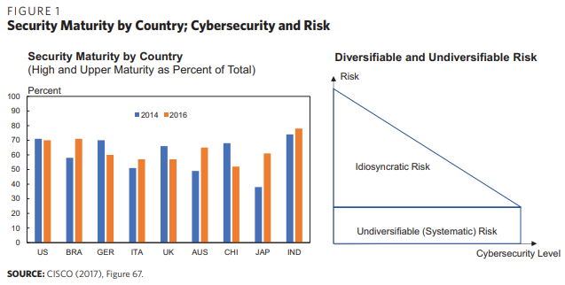
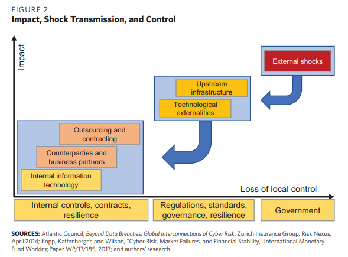

## Cyber Risk Scenarios, the Financial System, and Systemic Risk Assessment

### 1. Introduction

본 논문의 목적 : Systemic Cyber risk에 대한 이해도 높이기

- 시나리오 작성을 통한 사이버 리스크의 특성에 대한 설명
  - 발생 범위가 개인기업 단위인 것부터 upstream infrastructure disruption ~ external shocks까지 다룸
- Systemic 사이버리스크 평가를 위한 프레임워크 구축

### 2. Properties of Cyber Risk

#### Complexity and Risk Aggregation

근 15년 동안 인터넷 사용률 증가하면서 많은 IoT 서비스들의 기술적 취약점 발생

- 이러한 소프트웨어의 결점으로 사이버 안전 위험이 발생
  - maturity 높이면 경제적으로 돈이 많이 들기 때문에, 공급업체는 더 싼 가격에 저렴한 security 투자
  - 따라서 이로 인한 비분산 리스크는 무조건 존재
- 정보 비대칭과 어긋난 인센티브로 인해 만성적인 비분산 리스크를 야기하게 됨.
  - 이로 인해 다른 네트워크 사용자가 부담하는 부정적 외부효과를 생성.
  - 

시간이 지날수록, Cyber risk는 한 회사에만 국한되는 것이 아닌 **회사의 파트너까지 연결되어 복합적으로 발생하기 시작**함

- 이렇게 되면서, 사이버리스크는 한 개인회사의 통제를 벗어나게 됨
  - upstream infrastructure : electricity, telecommunication, financial market infrastructure
  - technological externalities : the entry of disruptive new technologies
- 이때, 파트너들의 사이버리스크 노출을 관찰하는 것은 어려움
- 또한 자연재해, 군대공격과 같이 정부의 개입이 필요한 예상치못한 리스크들 발생할 수 있음.
- 

전세계적으로, 사이버리스크로 인한 손실은 1년에 2500억달러~1조달러까지 이른다.

- 직접적 비용에 대한 정보는 잘 구축되어 있음
  - 대표적으로 법의학 조사, 법률지원, 고객 공지, 위반 후 고객 보안 및 신용, 보호비용 등이 있음.
- 하지만 **간접적 비용에 대한 정보는 장기간이며, 측량하기가 어려움.**
  - 대표적으로 평판리스크, 지적재산의 감가상각, 지속적인 운영/위험비용의 증가가 있음.

#### Systemic Risk

사이버리스크 평가는 개별 수준에 대해서는 우세를 보이나, 시스템차원에 대해서는 상당히 좁은 관점을 보임

- 현재 금융기관에서의 리스크 평가는 개인 회사단위에 집중
- 사이버의 시스템적인 본성에 대한 고려 없음
- 시스템적인 본성이란?
  - 사이버리스크는 복잡한 인프라에 대한 의존성으로 인해 발생함
  - 사이버리스크는 주요 정보 시스템 방해로부터 발생함.

Systemic Cyber risk는 아래 세 가지 요인에 의해 발생한다.

- 리스크 수렴과 대체가능성의 부족
  - 

### 3. Scenarios

#### Scale and Timing